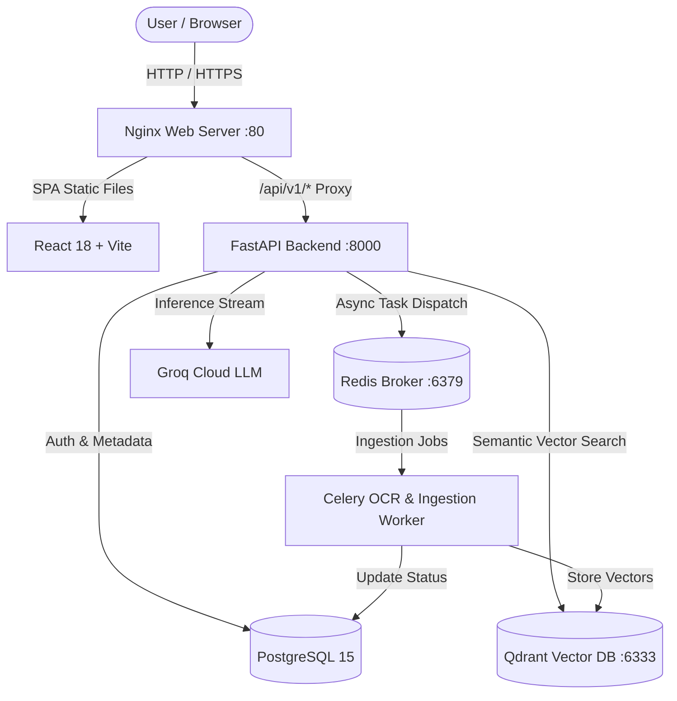

<div align="center">

# 🧠 DocuMind AI

**Enterprise Document Intelligence & Multimodal RAG Platform**

[](https://github.com/abderrahmane0402/DocuMind-AI/actions/workflows/ci.yml)
[](https://fastapi.tiangolo.com)
[](https://react.dev)
[](https://www.typescriptlang.org)
[](https://tailwindcss.com)
[](https://qdrant.tech)
[](https://opensource.org/licenses/MIT)

Transform complex documents, contracts, and financial statements into instantly queryable insights using high-speed vector retrieval and advanced LLM reasoning.

[Features](#-key-features) • [Architecture](#-architecture) • [Quickstart](#-quickstart-with-docker) • [Tech Stack](#-tech-stack) • [License](#-license)

</div>

---

## ⚡ Key Features

- **⚡ Real-Time Streaming RAG**: Instant, low-latency streaming responses powered by Groq LLMs and Qdrant semantic vector search.
- **📄 Multimodal Document Ingestion**: PyMuPDF extraction with automatic fallback to **Tesseract OCR** for scanned PDFs and image-based documents.
- **💬 Persistent Chat Sessions**: Multi-conversation management with full chat history, context continuity, and session deletion.
- **📁 Document Management Center**: Single and bulk document deletion with automatic vector embedding cleanup in Qdrant.
- **📱 Responsive Enterprise UI**: Clean, responsive dashboard built with React 18, Vite, Tailwind CSS v4, Lucide icons, and Geist typography.
- **⚙️ Asynchronous Processing**: Background document chunking, embedding generation, and vector indexing using **Celery** and **Redis**.
- **🔒 Enterprise Security**: JWT-based authentication, bcrypt password hashing, and complete tenant/workspace isolation.
- **🐳 Production Ready**: Fully containerized with Docker, Nginx reverse proxy with SPA routing, and GitHub Actions CI.

---

## 🏛️ Architecture



---

## 🚀 Quickstart with Docker

The fastest way to spin up DocuMind AI locally is using Docker Compose:

### 1. Clone the repository
```bash
git clone https://github.com/abderrahmane0402/DocuMind-AI.git
cd DocuMind-AI
```

### 2. Configure environment variables
```bash
cp .env.example .env
```
Edit `.env` and provide your **Groq API Key**:
```env
GROQ_API_KEY=gsk_your_groq_api_key_here
SECRET_KEY=your_super_secret_jwt_key
```

### 3. Start the entire application
```bash
docker compose -f docker-compose.prod.yml up -d --build
```

Access the application in your browser:
- **Web UI**: `http://localhost`
- **FastAPI Interactive Docs**: `http://localhost/api/v1/docs`

---

## 🛠️ Tech Stack

| Layer | Technology |
|---|---|
| **Frontend** | React 18, TypeScript, Vite, Tailwind CSS v4, Lucide Icons, Geist Font |
| **Backend API** | FastAPI, Pydantic v2, SQLAlchemy 2.0, Alembic, Uvicorn |
| **LLM & Embeddings** | Groq (Llama 3 / Mixtral), Sentence-Transformers (`all-MiniLM-L6-v2`) |
| **Vector Database** | Qdrant Vector Engine |
| **Task Queue** | Celery, Redis |
| **Relational Database** | PostgreSQL 15 |
| **OCR & PDF** | PyMuPDF (fitz), Tesseract OCR, Poppler |
| **DevOps & CI** | Docker, Docker Compose, Nginx, GitHub Actions |

---

## 💻 Local Development Setup

If you prefer to run the frontend and backend outside Docker:

### Prerequisites
- Python 3.12+
- Node.js 20+ / 22+
- Docker (for database dependencies)

### 1. Start Database Services
```bash
docker compose up -d db redis qdrant
```

### 2. Backend Setup
```bash
cd apps/backend
python -m venv .venv
source .venv/bin/activate  # On Windows: .venv\Scripts\activate
pip install -r requirements.txt

# Run migrations
alembic upgrade head

# Start API
uvicorn app.main:app --reload --port 8000

# Start Celery Worker (in a separate terminal)
celery -A app.core.celery_app.celery_app worker --loglevel=info
```

### 3. Frontend Setup
```bash
cd apps/frontend
npm install
npm run dev
```
Open `http://localhost:5173` in your browser.

---

## 🧪 Running Tests

```bash
# Backend pytest suite
pytest apps/backend/tests -v

# Frontend TypeScript check and production build
cd apps/frontend && npm run build
```

---

## 📄 License

This project is licensed under the [MIT License](LICENSE).