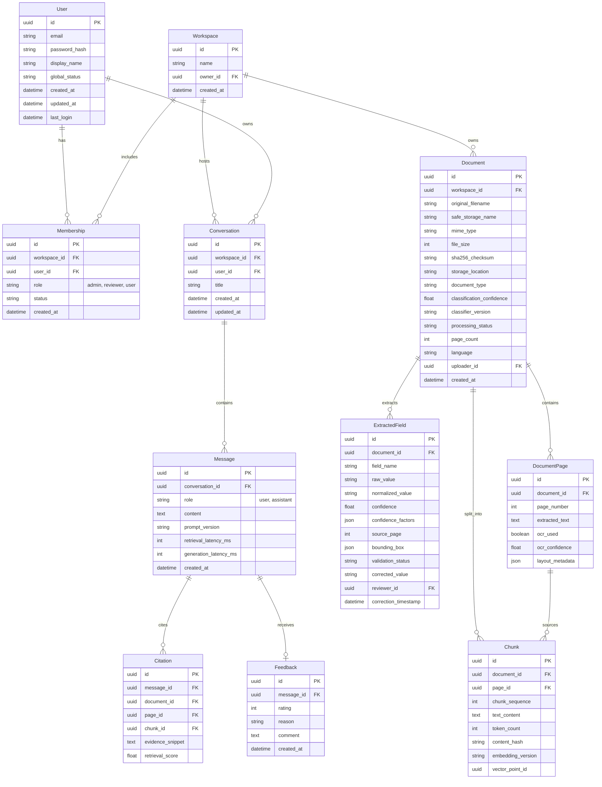

# DocuMind AI - Entity Relationship Diagram

## Core Entities

```mermaid
erDiagram
    User ||--o{ Membership : has
    Workspace ||--o{ Membership : includes
    Workspace ||--o{ Document : owns
    Document ||--o{ DocumentPage : contains
    Document ||--o{ ExtractedField : extracts
    Document ||--o{ Chunk : split_into
    DocumentPage ||--o{ Chunk : sources
    Workspace ||--o{ Conversation : hosts
    User ||--o{ Conversation : owns
    Conversation ||--o{ Message : contains
    Message ||--o{ Citation : cites
    Message ||--o| Feedback : receives

    User {
        uuid id PK
        string email
        string password_hash
        string display_name
        string global_status
        datetime created_at
        datetime updated_at
        datetime last_login
    }

    Workspace {
        uuid id PK
        string name
        uuid owner_id FK
        datetime created_at
    }

    Membership {
        uuid id PK
        uuid workspace_id FK
        uuid user_id FK
        string role "admin, reviewer, user"
        string status
        datetime created_at
    }

    Document {
        uuid id PK
        uuid workspace_id FK
        string original_filename
        string safe_storage_name
        string mime_type
        int file_size
        string sha256_checksum
        string storage_location
        string document_type
        float classification_confidence
        string classifier_version
        string processing_status
        int page_count
        string language
        uuid uploader_id FK
        datetime created_at
    }

    DocumentPage {
        uuid id PK
        uuid document_id FK
        int page_number
        text extracted_text
        boolean ocr_used
        float ocr_confidence
        json layout_metadata
    }

    ExtractedField {
        uuid id PK
        uuid document_id FK
        string field_name
        string raw_value
        string normalized_value
        float confidence
        json confidence_factors
        int source_page
        json bounding_box
        string validation_status
        string corrected_value
        uuid reviewer_id FK
        datetime correction_timestamp
    }

    Chunk {
        uuid id PK
        uuid document_id FK
        uuid page_id FK
        int chunk_sequence
        text text_content
        int token_count
        string content_hash
        string embedding_version
        uuid vector_point_id
    }

    Conversation {
        uuid id PK
        uuid workspace_id FK
        uuid user_id FK
        string title
        datetime created_at
        datetime updated_at
    }

    Message {
        uuid id PK
        uuid conversation_id FK
        string role "user, assistant"
        text content
        string prompt_version
        int retrieval_latency_ms
        int generation_latency_ms
        datetime created_at
    }

    Citation {
        uuid id PK
        uuid message_id FK
        uuid document_id FK
        uuid page_id FK
        uuid chunk_id FK
        text evidence_snippet
        float retrieval_score
    }

    Feedback {
        uuid id PK
        uuid message_id FK
        int rating
        string reason
        text comment
        datetime created_at
    }
```
